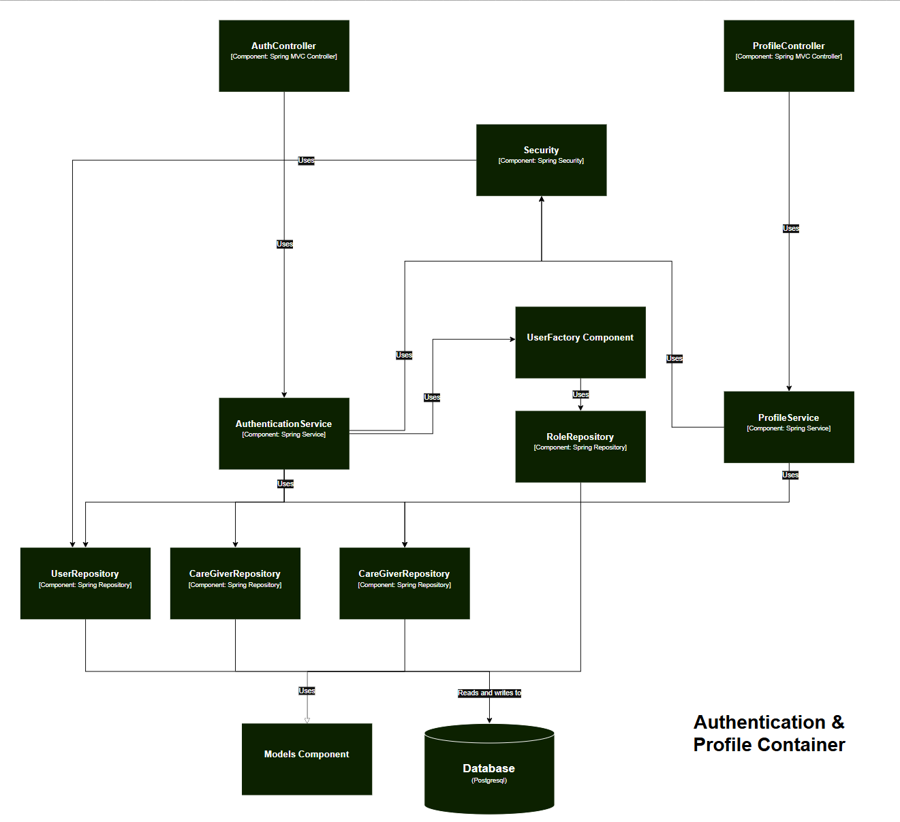
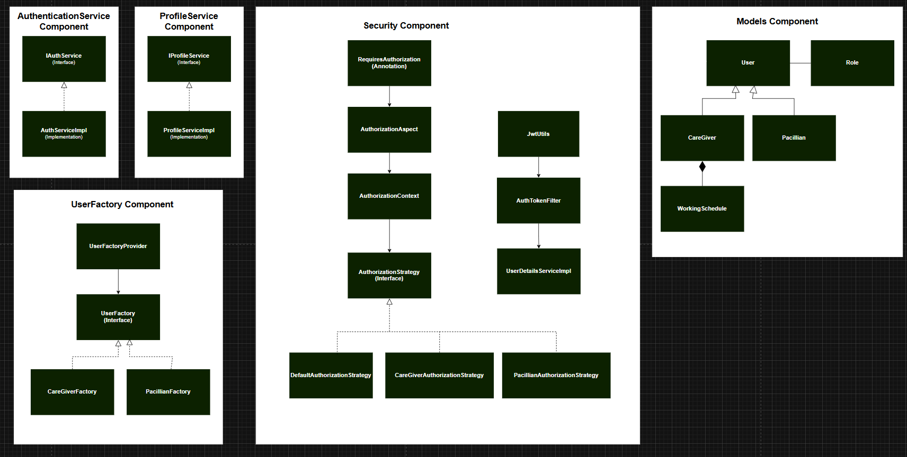

# PandaCare Frontend

This is the frontend for PandaCare, an E-Health platform designed for Fasilkom UI students and the university community. The application enables online medical consultations, appointment scheduling, and access to health information.

### Individual Works  

<<<<<<< HEAD
**Rating**  
  
  
=======
## Component Diagram
  
## Code Diagrams
  
### Prerequisites

- Node.js 16.x or later
- npm or yarn

### Installation

1. Clone the repository:
   ```bash
   git clone <repository-url>
   cd pandacare-frontend
   ```

2. Install dependencies:
   ```bash
   npm install
   # or
   yarn install
   ```

3. Create a `.env.local` file in the root directory and add the following environment variables:
   ```
   NEXT_PUBLIC_API_URL=http://ec2-13-219-192-16.compute-1.amazonaws.com:8081
   ```

4. Start the development server:
   ```bash
   npm run dev
   # or
   yarn dev
   ```

5. Open [http://localhost:3000](http://localhost:3000) in your browser to see the application.

## 📄 Project Structure

- `/src` - Source code
  - `/app` - Next.js App Router components
    - `/login` - Login page
    - `/register` - Registration pages
      - `/pacillian` - Patient registration
      - `/caregiver` - Doctor registration
    - `/dashboard` - User dashboard
    - `layout.js` - Root layout component
    - `page.js` - Home page
  - `/components` - Reusable React components (to be created)
  - `/utils` - Utility functions (to be created)

## 🧩 Features

- **Authentication System**
  - User registration (Pacillians and CareGivers)
  - User login
  - Protected routes

- **Online Consultation**
  - Search and view doctor profiles
  - Schedule consultations
  - Chat with doctors
  - Rate and review doctors

- **Profile Management**
  - View and update personal information
  - Manage consultation history
  - View ratings and reviews

## 📱 Interface

- Clean, modern UI with responsive design
- Tailwind CSS for styling
- Separate themes for patients and healthcare providers
- Interactive form validation
- Toast notifications for user feedback

## 🔒 Authentication Flow

The application uses JWT (JSON Web Tokens) for authentication:

1. User logs in with email and password
2. Server validates credentials and returns a JWT token
3. Token is stored in localStorage
4. Token is included in the Authorization header for API requests
5. Protected routes check for valid token before rendering

## 🔄 API Integration

The frontend connects to the backend API at `http://ec2-13-219-192-16.compute-1.amazonaws.com:8081/api/`.

Key endpoints:
- `/api/auth/login` - User authentication
- `/api/auth/register/pacillian` - Patient registration
- `/api/auth/register/caregiver` - Doctor registration
- `/api/profile` - User profile management
- `/api/caregiver/all` - List of doctors
- `/api/caregiver/search` - Search doctors by name or specialty

## 📝 Development Notes

- Add placeholder images to the `/public` folder (especially logo.png and hero-image.jpg)
- Complete implementation of remaining pages:
  - Doctor listing and search
  - Consultation management
  - Chat interface
  - Profile management
- Consider adding state management like Redux or Zustand for larger application state

## 🚢 Deployment

Build the production application:
```bash
npm run build
# or
yarn build
```

Start the production server:
```bash
npm run start
# or
yarn start
```

## 🛠️ Tech Stack

- **Framework**: Next.js 14 with App Router
- **UI**: React 18
- **Styling**: Tailwind CSS
- **Authentication**: JWT
- **Form Handling**: React Hooks
- **Notifications**: React-Toastify
>>>>>>> 6270daa (Submitting Individual Diagram for Module 9)
