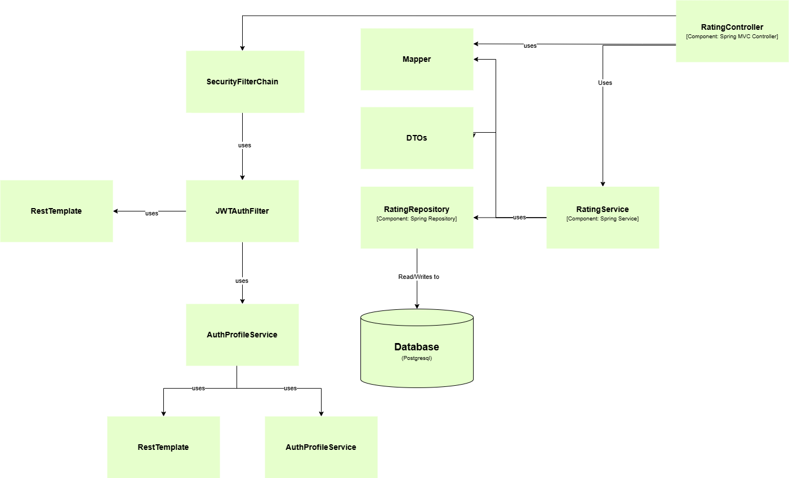
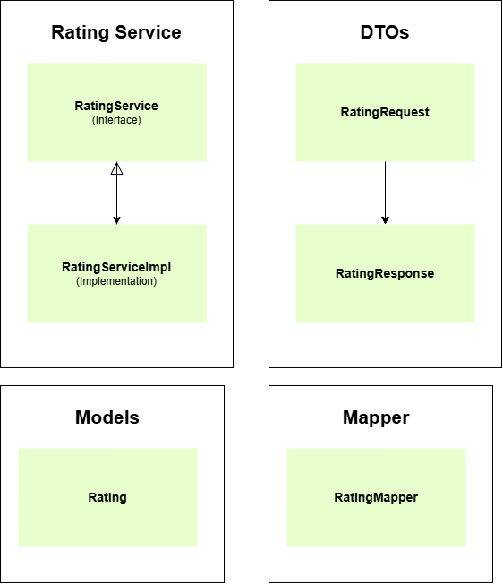

# PandaCare Frontend

This is the frontend for PandaCare, an E-Health platform designed for Fasilkom UI students and the university community. The application enables online medical consultations, appointment scheduling, and access to health information.

### Individual Works  

**Rating**  
  
  