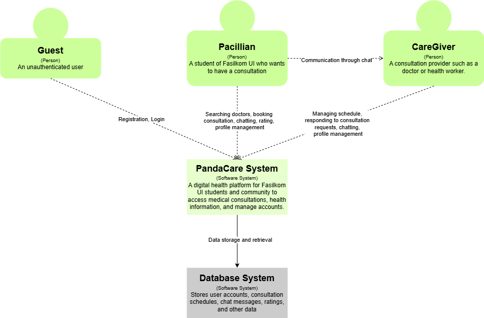
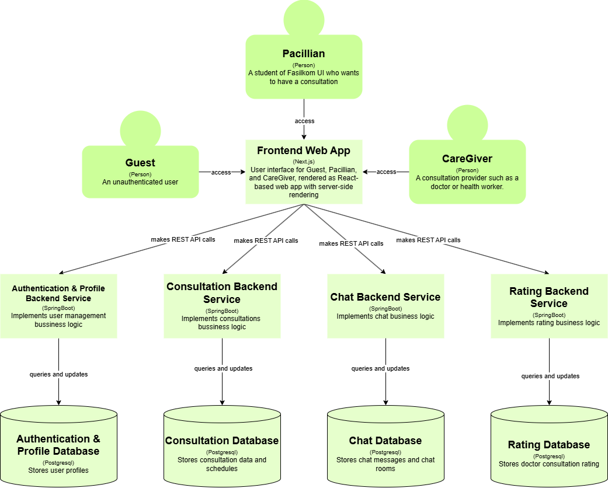
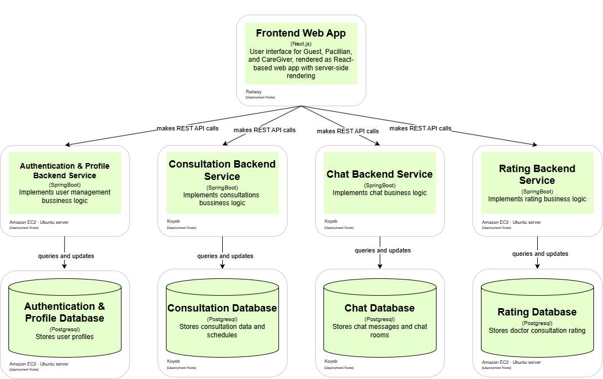
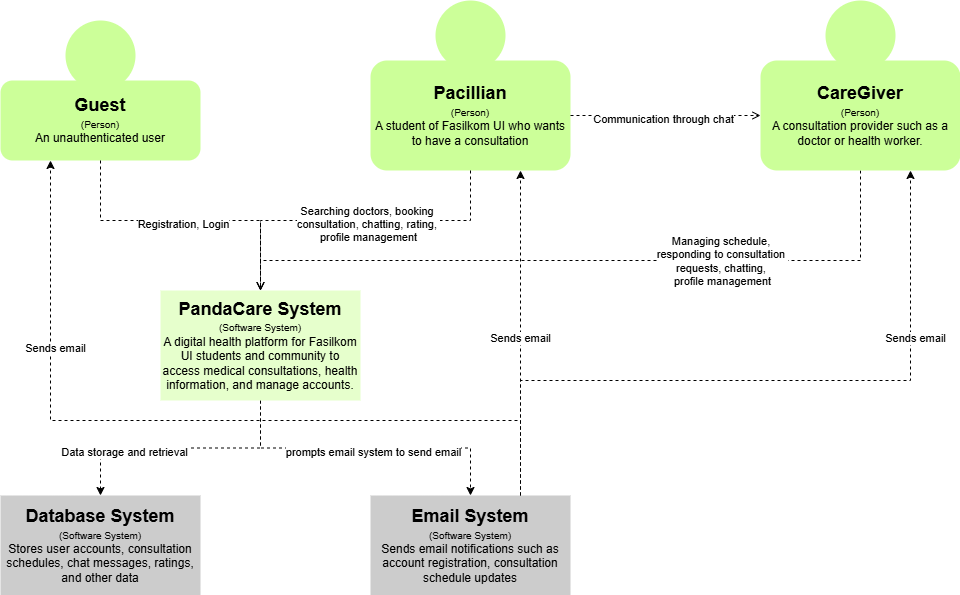
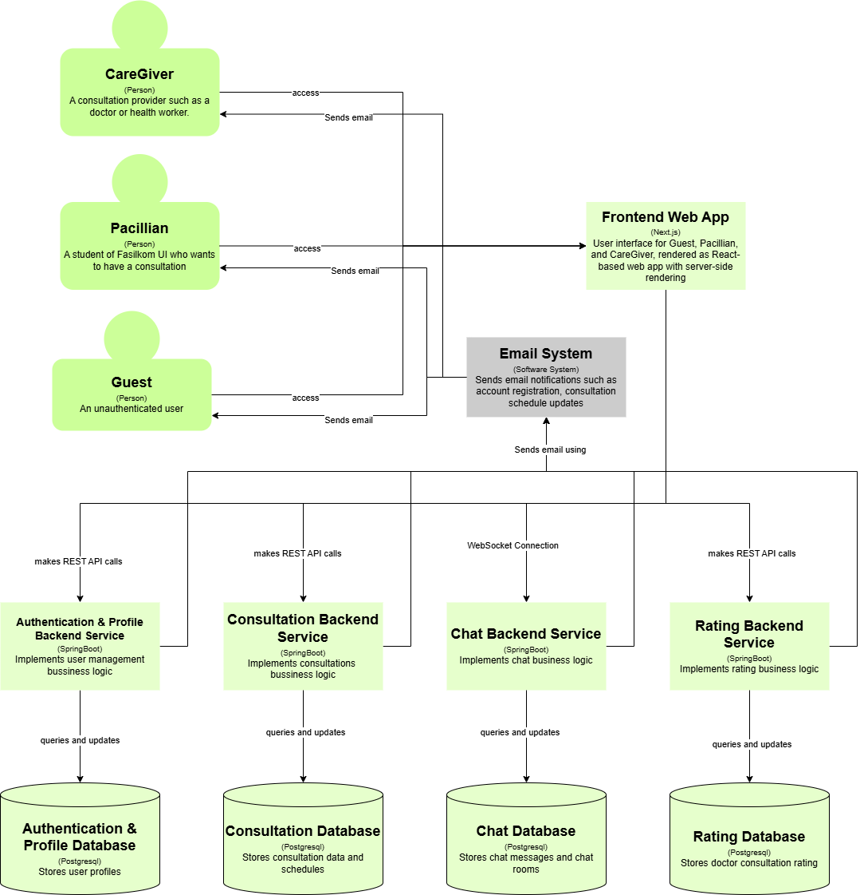

# PandaCare Frontend

This is the frontend for PandaCare, an E-Health platform designed for Fasilkom UI students and the university community. The application enables online medical consultations, appointment scheduling, and access to health information.

## Module 9  
**Context Diagram**  
  

**Container Diagram**    
  

**Deployment Diagram**    
  

**Future Context Diagram**  
  

**Future  Container Diagram**  
  

### Risk Analysis
Our team applied the Risk Storming technique to evaluate potential architectural vulnerabilities in our PandaCare application as it scales. This collaborative approach helped identify critical risks that could impact performance, security, and user experience as our platform grows.   

**Key Risks Identified**

1. Real-time Communication Bottlenecks  
Risk Assessment: The initial REST API communication between the frontend and Chat Backend Service would cause latency issues and poor user experience as message volume increases.  
Solution: We've redesigned this connection to use WebSocket protocol instead of REST APIs. This change enables real-time bidirectional  communication, reducing latency and supporting instantaneous message delivery even under high load.  

2. Communication Reliability and User Engagement  
Risk Assessment: Users might miss important updates about consultations or account changes when not actively using the application.  
Solution: We've introduced a dedicated Email Notification System that sends automated alerts for critical events such as:   
- Account registration confirmation  
- Consultation scheduling and changes  
- Important system updates  
- Appointment reminders  
This ensures critical information reaches users even when they're offline.

**Implementation Impact Analysis**  
The architectural changes we've made address several potential failure points:
- Improved Real-time Experience: WebSocket implementation provides the seamless, responsive chat experience users expect from modern healthcare communication platforms.  
- Enhanced Reliability: Email notifications create a redundant communication channel, ensuring critical information reaches users through multiple pathways.  

**Conclusion**  
Applying Risk Storming as a team-based analysis technique allowed us to proactively identify and address potential architectural weaknesses before they impacted users. The resulting architecture is more resilient, scalable, and provides a better user experience.  
As our user base continues to grow, we plan to regularly revisit this analysis to address emerging risks and ensure our architecture continues to meet performance and security requirements.  